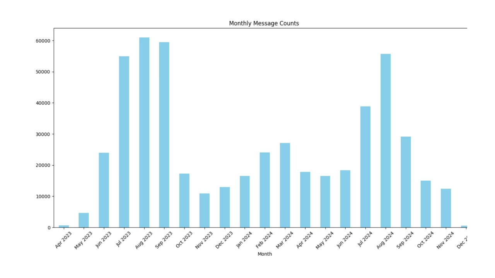
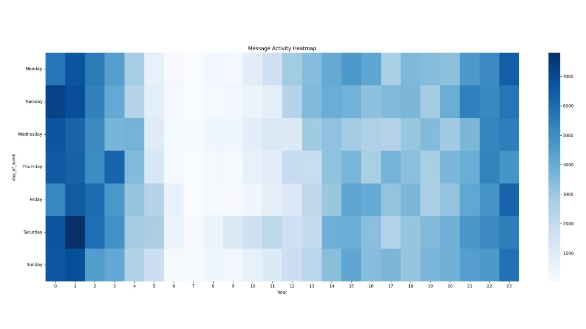

# Telegram Chat Analyzer 📊

Welcome to the **Telegram Chat Analyzer**! This tool helps you gain insightful analytics from your Telegram chat history. 🎉



## Features 🚀

- **Messages by Sender**: View the number of messages sent by each participant.
- **Word Frequencies**: Find out the most commonly used words.
- **Emoji Counts**: See which emojis are used most often.
- **Monthly Message Trends**: Analyze message counts over each month.
- **Message Types**: Breakdown of messages by type (text, media, etc.).
- **Edited Messages**: Count how many messages were edited.
- **Media Durations**: Total durations of video and voice messages.
- **Forwarded Messages**: Identify who forwards messages the most.
- **Conversation Starters**: Find out who initiates conversations frequently.
- **Replies Analysis**: See reply patterns among participants.
- **Average Message Length**: Calculate average message lengths.
- **Activity Heatmap**: Visualize chat activity over days and hours.
- **Reactions Count**: Count reactions made by users.

## Getting Started 🛠️

### Prerequisites 📋

- **Python 3.x**
- Required Python libraries:
  - pandas
  - matplotlib
  - seaborn
  - emoji

Install the required libraries using:

```sh
pip install -r requirements.txt
```

### Exporting Telegram Chat History 💬

1. Open the **Telegram Desktop** application.
2. Navigate to the chat you want to analyze.
3. Click on the chat header to open chat settings.
4. Click on **"⋮" (three dots)** and select **"Export chat history"**.
5. In the export dialog:
   - **Format**: Choose **JSON**.
   - **Data to export**: Select **"Messages"** and any other data you want.
   - **Path**: Set the destination path for the exported file.
6. Click **"Export"** and wait for the process to complete.



### Placing the Exported File 📂

- Rename the exported file to ```chat_history.json```.
- Place ```chat_history.json``` in the root directory of this project.

## Running the Analyzer ▶️

Execute the following command in your terminal:

```sh
python main.py
```

This will run the analysis and display results in the console. Visualizations like charts and heatmaps will pop up if enabled.

## Data Analyzed 📈

The analyzer processes your chat data to provide insights:

- **Messages by Sender**: Total messages sent by each user.
- **Most Common Words**: Top words used overall and by individual users.
- **Most Common Emojis**: Frequently used emojis in the chat.
- **Monthly Message Counts**: Message totals for each month.
- **Message Types**: Counts of different types of messages (e.g., text, image).
- **Edited Messages**: Number of messages that were edited.
- **Media Durations**: Sum durations of voice and video messages by user.
- **Forwarded Messages**: Statistics on forwarded messages.
- **Conversation Starters**: Users who start new conversations most often.
- **Replies Analysis**: Users who reply the most and messages that received the most replies.
- **Average Message Length**: Average length of messages per user.
- **Activity Heatmap**: Heatmap of message activity by hour and day.
- **Reactions Count**: Number of reactions used by each user.

## Contributing 🤝

Contributions are welcome! Feel free to submit issues or pull requests.

---

Enjoy analyzing your Telegram chats! 📊✨